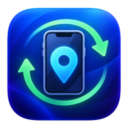
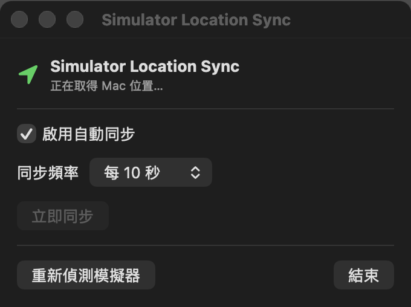

# Simulator Location Sync

[English](README.md)



一個輕量的 macOS 選單列 App，會定時將 Mac 的目前位置同步到 Xcode Device Hub 中所有已啟動的模擬器。

## 執行畫面



## 功能

- 完全常駐於 macOS 選單列，不顯示在 Dock
- 使用 Core Location 取得 Mac 的目前位置
- 自動偵測所有已啟動且可用的模擬器
- 支援每 5 秒、10 秒、30 秒、1 分鐘或 5 分鐘同步
- 可暫停自動同步或手動立即同步
- 顯示最新座標、同步時間、模擬器數量及錯誤訊息
- 原生支援 Apple Silicon 與 Intel Mac

## 系統需求

- macOS 13 或更新版本
- 已安裝 Xcode 及至少一個 Simulator Runtime
- 允許 Simulator Location Sync 使用定位服務

## 建置及安裝

1. Clone 此 Repository。
2. 執行 Release 建置腳本：

   ```sh
   ./scripts/build-release.sh
   ```

3. 開啟 `dist/SimulatorLocationSync.dmg`。
4. 將 **SimulatorLocationSync** 拖進 **Applications**。
5. 啟動 App，並在首次執行時允許定位權限。

App 啟動後只會在畫面右上方的選單列顯示定位圖示。啟動一台或多台 Simulator 後，App 預設每 10 秒同步一次位置。

也可以使用 Xcode 開啟 `SimulatorLocationSync.xcodeproj`，選擇 **My Mac** 後直接執行。

## 運作方式

App 透過 Core Location 取得 Mac 位置，並使用以下命令尋找已啟動的模擬器：

```sh
xcrun simctl list devices booted --json
```

接著將座標套用至每一台模擬器：

```sh
xcrun simctl location <simulator-udid> set <latitude>,<longitude>
```

定位資料只會留在本機，不會透過網路傳送。由於 App 必須執行 Xcode 的 `simctl` 命令列工具，因此刻意不啟用 App Sandbox。

## 發布

建置腳本會產生 Universal App，並使用適合本機執行的 ad-hoc 簽署。若要透過 GitHub Releases 公開提供給其他使用者，應使用 Apple Developer ID 憑證簽署並完成 Apple 公證，避免其他 Mac 出現 Gatekeeper 警告。

## 專案結構

```text
SimulatorLocationSync/          SwiftUI App 原始碼與資產
SimulatorLocationSync.xcodeproj Xcode 專案
scripts/build-release.sh        Universal App 與 DMG 建置腳本
```

## 授權

目前尚未加入授權條款。在接受外部貢獻或重新散佈專案之前，請先加入合適的 License。
